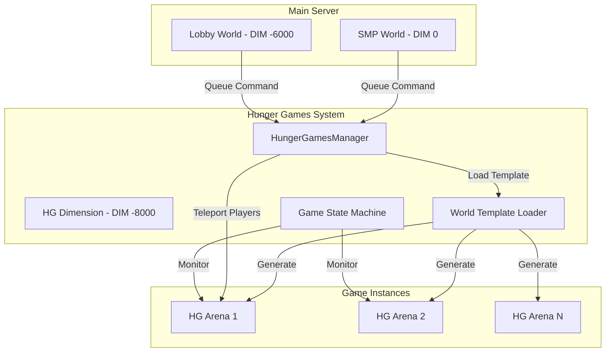

# Hunger Games Multi-World Architecture Plan

## Executive Summary

**YES, this is absolutely plausible!** Your existing mod already demonstrates sophisticated multi-world management with the PvP arena system. Forge provides full access to dimension management, world loading, and player teleportation - capabilities that go far beyond what Bukkit offers.

## Current Architecture Analysis

### ✅ What You Already Have

1. **Custom Dimension System** ([`ArenaWorldProvider.java`](../src/main/java/com/matoon/herosmp/npc/pvp/ArenaWorldProvider.java))
   - Custom `WorldProvider` implementation
   - Dynamic dimension registration via `DimensionManager`
   - Separate save files per dimension (`DIM-7000`)
   - Custom chunk generation with [`BoundedOverworldChunkGenerator`](../src/main/java/com/matoon/herosmp/npc/pvp/BoundedOverworldChunkGenerator.java)

2. **Player Teleportation** ([`PvpQueueManager.java`](../src/main/java/com/matoon/herosmp/npc/PvpQueueManager.java:923-930))
   - `player.changeDimension()` for cross-world teleportation
   - Custom `FixedTeleporter` for precise positioning
   - State preservation (inventory, location, gamemode)

3. **World Isolation**
   - Each dimension has separate save files
   - Arena slots prevent interference between matches
   - Cleanup system for unused arenas

### 🎯 Why This Works for Hunger Games

Your concerns about security are valid, but your architecture already solves them:
- **Separate dimensions = Separate save files** ✅
- **No cross-dimension teleportation exploits** (players can't teleport between dimensions without your code) ✅
- **Complete world isolation** (SMP items stay in SMP, HG items stay in HG) ✅

---

## Hunger Games Architecture Design

### System Overview



### Core Components

#### 1. HungerGamesWorldProvider
**Purpose**: Custom dimension for Hunger Games arenas
**Location**: `src/main/java/com/matoon/herosmp/hungergames/world/HungerGamesWorldProvider.java`

```java
// Similar to ArenaWorldProvider but with:
// - Support for pre-built world templates
// - Larger arena sizes (configurable)
// - Optional world border enforcement
// - Custom spawn point management
```

#### 2. HungerGamesManager
**Purpose**: Central game orchestration
**Location**: `src/main/java/com/matoon/herosmp/hungergames/HungerGamesManager.java`

**Responsibilities**:
- Queue management (similar to PvpQueueManager)
- Game instance creation and lifecycle
- Player state preservation
- World template loading
- Victory/elimination handling

#### 3. WorldTemplateLoader
**Purpose**: Load pre-built worlds or generate procedural arenas
**Location**: `src/main/java/com/matoon/herosmp/hungergames/world/WorldTemplateLoader.java`

**Capabilities**:
- Load from structure files (`.nbt` schematics)
- Load from world folders (copy existing world data)
- Procedural generation fallback
- Chest loot placement
- Spawn point configuration

#### 4. HungerGamesMatch
**Purpose**: Individual game instance state
**Location**: `src/main/java/com/matoon/herosmp/hungergames/HungerGamesMatch.java`

**State Management**:
- Player list and status (alive/spectating/eliminated)
- Game phase (lobby → countdown → grace period → active → ending)
- World border shrinking
- Supply drop events
- Kill tracking and statistics

---

## World Template System

### Option 1: Structure Files (.nbt)
**Best for**: Small to medium arenas (up to 512x512 blocks)

```
config/herosmp/hungergames/templates/
├── classic_forest.nbt
├── desert_wasteland.nbt
├── snow_biome.nbt
└── custom_map.nbt
```

**Pros**:
- Easy to create with Structure Blocks
- Portable and shareable
- Fast loading

**Cons**:
- Size limitations
- No natural terrain generation

### Option 2: World Folder Templates
**Best for**: Large, naturally generated worlds

```
config/herosmp/hungergames/worlds/
├── forest_arena/
│   ├── region/
│   ├── data/
│   └── level.dat
└── island_survival/
    ├── region/
    ├── data/
    └── level.dat
```

**Pros**:
- Full-size worlds with natural terrain
- Can use WorldPainter or other tools
- Supports all Minecraft features

**Cons**:
- Larger file sizes
- Slower initial load

### Option 3: Procedural Generation
**Best for**: Infinite variety, testing

```java
// Use existing chunk generator with custom settings
// Similar to your BoundedOverworldChunkGenerator
// Add custom structures, chest spawns, etc.
```

**Pros**:
- No template files needed
- Infinite variety
- Lightweight

**Cons**:
- Less control over layout
- May need balancing

---

## Game Flow Design

### Phase 1: Queue System

```java
// Command: /hg join [template_name]
// Players queue for Hunger Games
// Minimum players: 2 (configurable)
// Maximum players: 24 (configurable)
// Countdown starts when minimum reached
```

**Similar to**: Your existing FFA queue system

### Phase 2: Pre-Game Lobby

```java
// Duration: 30 seconds (configurable)
// Players spawn on pedestals/platforms
// Frozen in place (like your prep phase)
// Kit selection (optional)
// Countdown display
```

**Reuse**: Your existing freeze mechanics and countdown system

### Phase 3: Grace Period

```java
// Duration: 30-60 seconds (configurable)
// PvP disabled
// Players can gather resources
// Chest loot available
// Countdown to PvP enabled
```

### Phase 4: Active Game

```java
// PvP enabled
// World border shrinks over time
// Supply drops at intervals
// Player tracking (optional)
// Last player/team standing wins
```

### Phase 5: Victory

```java
// Winner celebration (fireworks, titles)
// Statistics display
// Teleport back to origin
// Inventory restoration
// Arena cleanup
```

**Reuse**: Your existing victory sequence system

---

## Player State Management

### State Preservation (Already Implemented!)

Your [`ReturnState`](../src/main/java/com/matoon/herosmp/npc/PvpQueueManager.java:2841-2890) and [`PlayerInventorySnapshot`](../src/main/java/com/matoon/herosmp/npc/PvpQueueManager.java:2892-2917) classes are perfect:

```java
// Before entering HG:
ReturnState returnState = ReturnState.capture(player);
PlayerInventorySnapshot inventory = PlayerInventorySnapshot.capture(player);

// After game ends:
restorePlayer(player, returnState);
inventory.restore(player);
```

### Security Measures

1. **Dimension Isolation**
   - HG dimension ID: `-8000` (separate from arena `-7000`)
   - Separate save folder: `DIM-8000/`
   - No cross-dimension item transfer

2. **Teleportation Control**
   - Only your mod can teleport between dimensions
   - Disable teleportation items/abilities in HG
   - Validate all dimension changes

3. **Inventory Management**
   - Clear inventory on entry
   - Store original inventory
   - Restore on exit/death
   - Prevent item duplication

4. **World Protection**
   - Prevent block breaking outside arena bounds
   - Disable certain items/abilities
   - World border enforcement
   - Anti-cheat integration points

---

## Configuration System

### Config File: `config/herosmp/hungergames.cfg`

```properties
# General Settings
enabled=true
minPlayers=2
maxPlayers=24
queueCountdownSeconds=30

# Game Settings
gracePeriodSeconds=60
maxGameDurationMinutes=30
worldBorderEnabled=true
worldBorderStartSize=1000
worldBorderEndSize=50
worldBorderShrinkStartMinutes=5

# World Templates
defaultTemplate=classic_forest
allowPlayerTemplateSelection=true
randomTemplateSelection=false

# Loot Settings
chestRefillEnabled=true
chestRefillIntervalMinutes=5
supplyDropEnabled=true
supplyDropIntervalMinutes=3

# Player Settings
allowKitSelection=true
keepInventoryOnDeath=false
spectateOnDeath=true
showPlayerCount=true
showKillFeed=true

# Dimension Settings
dimensionId=-8000
dimensionName=herosmp_hungergames
```

---

## Command Structure

### Player Commands

```
/hg join [template] - Join Hunger Games queue
/hg leave - Leave queue
/hg spectate <player> - Spectate active game
/hg stats - View your statistics
/hg templates - List available templates
```

### Admin Commands

```
/hg start [template] [players...] - Force start game
/hg stop <gameId> - Stop active game
/hg reload - Reload configuration
/hg template <add|remove|list> - Manage templates
/hg setspawn <spawnId> - Set spawn point in template
/hg setchest <tier> - Mark chest location
```

---

## Implementation Phases

### Phase 1: Core Infrastructure
- Create `HungerGamesWorldProvider`
- Implement dimension registration
- Basic teleportation system
- Player state preservation

### Phase 2: Game Logic
- Queue system
- Game state machine
- Phase transitions
- Victory conditions

### Phase 3: World Templates
- Structure file loader
- World folder loader
- Spawn point management
- Chest loot system

### Phase 4: Advanced Features
- World border shrinking
- Supply drops
- Statistics tracking
- Spectator mode

### Phase 5: Polish & Testing
- Configuration system
- Commands
- GUI integration
- Balance testing

---

## Technical Implementation Details

### Dimension Registration

```java
// Similar to your arena system
private static final int HG_DIMENSION_ID = -8000;
private static final int HG_DIMENSION_TYPE_ID = 17771;
private static final String HG_DIMENSION_TYPE_NAME = "herosmp_hungergames";

private DimensionType getOrCreateHGDimensionType() {
    try {
        return DimensionType.register(
            HG_DIMENSION_TYPE_NAME,
            "_herosmp_hg",
            HG_DIMENSION_TYPE_ID,
            HungerGamesWorldProvider.class,
            false
        );
    } catch (IllegalArgumentException e) {
        // Already registered
        return DimensionType.byName(HG_DIMENSION_TYPE_NAME);
    }
}
```

### World Template Loading

```java
// Option 1: Load from structure file
public void loadStructureTemplate(WorldServer world, String templateName, BlockPos origin) {
    Template template = loadTemplate(templateName);
    PlacementSettings settings = new PlacementSettings();
    template.addBlocksToWorld(world, origin, settings);
}

// Option 2: Copy from world folder
public void loadWorldTemplate(WorldServer targetWorld, File sourceWorldFolder) {
    // Copy region files
    // Copy data files
    // Update spawn points
}
```

### Player Teleportation

```java
// Reuse your existing system
public void teleportToHungerGames(EntityPlayerMP player, WorldServer hgWorld, BlockPos spawn) {
    // Save state
    ReturnState returnState = ReturnState.capture(player);
    PlayerInventorySnapshot inventory = PlayerInventorySnapshot.capture(player);
    
    // Clear inventory
    player.inventory.clear();
    
    // Teleport
    moveToDimension(player, hgWorld, 
        spawn.getX() + 0.5, spawn.getY(), spawn.getZ() + 0.5, 
        0.0F, 0.0F);
    
    // Store for later restoration
    storePlayerState(player.getUniqueID(), returnState, inventory);
}
```

### World Border Management

```java
public void setupWorldBorder(HungerGamesMatch match) {
    WorldServer world = server.getWorld(HG_DIMENSION_ID);
    WorldBorder border = world.getWorldBorder();
    
    // Set initial size
    border.setCenter(match.centerX, match.centerZ);
    border.setSize(config.worldBorderStartSize);
    
    // Schedule shrinking
    long shrinkStartTicks = config.worldBorderShrinkStartMinutes * 20 * 60;
    long shrinkDuration = (config.maxGameDurationMinutes - config.worldBorderShrinkStartMinutes) * 20 * 60;
    
    // Will shrink over time
    border.setTransition(config.worldBorderStartSize, config.worldBorderEndSize, shrinkDuration);
}
```

---

## Testing Strategy

### Single-Player Testing
Your mod works in single-player! Test phases:
1. Create test world
2. Join HG queue
3. Verify dimension creation
4. Test game phases
5. Verify return to overworld
6. Check inventory restoration

### Server Testing
1. Multiple players in queue
2. Concurrent games
3. Player disconnection handling
4. Server restart recovery
5. Performance under load

---

## Answers to Your Questions

### Q: Can Forge create custom worlds with separate save files?
**A: YES!** You're already doing this with your arena system. Each dimension gets its own save folder (`DIM-8000/`).

### Q: Can we prevent teleportation exploits?
**A: YES!** Dimensions are isolated. Players can only change dimensions through your code. Mods that add teleportation items can be blocked in HG dimension.

### Q: Can we load custom world templates?
**A: YES!** Multiple options:
- Structure files (`.nbt`)
- World folder copying
- Procedural generation
- Hybrid approaches

### Q: Will this work on both server and single-player?
**A: YES!** Your existing code already supports both. The dimension system works identically in both environments.

### Q: Is this better than Bukkit?
**A: ABSOLUTELY!** Forge gives you:
- Full dimension control
- Custom world generation
- Direct access to all game mechanics
- No API limitations
- Better performance
- More flexibility

---

## File Structure

```
src/main/java/com/matoon/herosmp/
├── hungergames/
│   ├── HungerGamesManager.java
│   ├── HungerGamesMatch.java
│   ├── HungerGamesConfig.java
│   ├── command/
│   │   ├── CommandHungerGames.java
│   │   └── CommandHGAdmin.java
│   ├── world/
│   │   ├── HungerGamesWorldProvider.java
│   │   ├── HungerGamesChunkGenerator.java
│   │   ├── WorldTemplateLoader.java
│   │   └── StructureLoader.java
│   ├── game/
│   │   ├── GamePhase.java
│   │   ├── GameState.java
│   │   ├── PlayerState.java
│   │   └── SupplyDropManager.java
│   ├── loot/
│   │   ├── HGLootManager.java
│   │   └── HGLootSavedData.java
│   └── events/
│       └── HungerGamesEvents.java
└── npc/
    └── pvp/ (existing)
```

---

## Next Steps

1. **Review this plan** - Does this align with your vision?
2. **Choose template system** - Structure files, world folders, or procedural?
3. **Define game rules** - Teams? Solo? Custom win conditions?
4. **Set priorities** - Which features are must-have vs nice-to-have?

Once you approve this architecture, we can move to implementation!

---

## Additional Considerations

### Performance
- Reuse your arena slot system for multiple concurrent games
- Implement chunk pre-generation
- Cleanup unused arenas aggressively
- Monitor memory usage with large templates

### Compatibility
- Works with your existing PvP system
- Can share kit system
- Can share loot system
- Independent dimension IDs prevent conflicts

### Extensibility
- Easy to add new game modes (Teams, Duos, etc.)
- Template system allows community maps
- Event system for custom mechanics
- API for other mods to integrate

---

**Bottom Line**: This is not only plausible, it's the PERFECT use case for Forge's dimension system. Your existing architecture proves you already understand the concepts. Hunger Games is just a larger-scale version of what you've already built!
