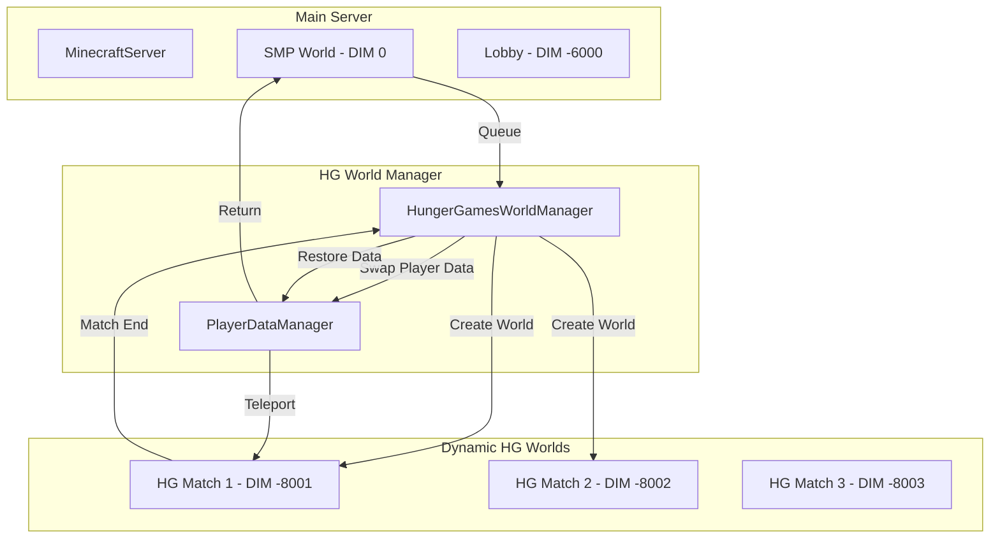

# Hunger Games True Multi-World System (Forge)

## Critical Understanding: Dimensions ARE Separate Worlds in Forge

### The Confusion Clarified

In Forge/Minecraft terminology:
- **Dimension** = A separate `WorldServer` instance with its own save folder
- **World** = Often used interchangeably with dimension
- Each dimension has completely separate:
  - Save files (region files, data files)
  - Player data (per-dimension)
  - Chunk loading
  - Entity tracking
  - Block states

**Your concern about inventory/data leaking is valid**, but the solution is different than you think.

---

## The Real Problem: Player Data Persistence

### Why Your Current System Has Issues

When you teleport players between dimensions using `player.changeDimension()`:
1. Player's inventory is preserved (same player entity)
2. Extended inventories from mods persist (Baubles, Tinkers, etc.)
3. Player data is shared across dimensions
4. You have to manually save/restore inventory

### What Hypixel Does (Bukkit Multi-World)

Hypixel uses Bukkit's multi-world system which:
1. Creates separate `World` objects (equivalent to Forge dimensions)
2. Each world has separate player data files
3. When players switch worlds, they get a **fresh player state**
4. No inventory carrying between worlds
5. Each world is truly isolated

---

## The Forge Solution: Dimension-Specific Player Data

### Option 1: Custom Player Data Per Dimension (Recommended)

Instead of fighting Forge's player persistence, embrace it but isolate data per-dimension:

```java
// When player enters HG dimension
public void onPlayerEnterHG(EntityPlayerMP player) {
    UUID playerId = player.getUniqueID();
    int sourceDim = player.dimension;
    
    // Save EVERYTHING from source dimension
    HGPlayerData.savePlayerState(playerId, sourceDim, player);
    
    // Clear player completely
    clearPlayerCompletely(player);
    
    // Load HG-specific player data (if exists from previous HG match)
    HGPlayerData.loadHGState(playerId, player);
    
    // Teleport to HG dimension
    player.changeDimension(HG_DIMENSION_ID, new FixedTeleporter(...));
}

// When player leaves HG dimension
public void onPlayerLeaveHG(EntityPlayerMP player) {
    UUID playerId = player.getUniqueID();
    int targetDim = player.returnDimension; // Where they came from
    
    // Save HG state (for if they rejoin)
    HGPlayerData.saveHGState(playerId, player);
    
    // Clear player completely
    clearPlayerCompletely(player);
    
    // Restore original dimension state
    HGPlayerData.restorePlayerState(playerId, targetDim, player);
    
    // Teleport back
    player.changeDimension(targetDim, new FixedTeleporter(...));
}

private void clearPlayerCompletely(EntityPlayerMP player) {
    // Clear main inventory
    player.inventory.clear();
    
    // Clear armor
    for (int i = 0; i < player.inventory.armorInventory.size(); i++) {
        player.inventory.armorInventory.set(i, ItemStack.EMPTY);
    }
    
    // Clear offhand
    player.inventory.offHandInventory.clear();
    
    // Clear capabilities (extended inventories)
    clearAllCapabilities(player);
    
    // Clear potion effects
    player.clearActivePotions();
    
    // Reset health/hunger
    player.setHealth(player.getMaxHealth());
    player.getFoodStats().setFoodLevel(20);
    
    // Clear XP
    player.experienceLevel = 0;
    player.experienceTotal = 0;
    player.experience = 0.0F;
}

private void clearAllCapabilities(EntityPlayerMP player) {
    // This is the key to handling mod inventories
    // Each mod registers capabilities - we need to clear them
    
    // Example for Baubles
    if (Loader.isModLoaded("baubles")) {
        IBaublesItemHandler baubles = BaublesApi.getBaublesHandler(player);
        for (int i = 0; i < baubles.getSlots(); i++) {
            baubles.setStackInSlot(i, ItemStack.EMPTY);
        }
    }
    
    // Example for Tinkers Construct
    if (Loader.isModLoaded("tconstruct")) {
        // Clear Tinkers inventory
    }
    
    // Add more mod-specific clearing as needed
}
```

### Option 2: Separate Player Files Per Dimension

Forge stores player data in `<world>/playerdata/<uuid>.dat`. We can manipulate this:

```java
public class DimensionPlayerDataManager {
    
    // When entering HG dimension, swap player data files
    public void swapToHGPlayerData(EntityPlayerMP player, int hgDimension) {
        UUID playerId = player.getUniqueID();
        
        // Save current player data to source dimension
        savePlayerData(player);
        
        // Get HG world
        WorldServer hgWorld = player.getServer().getWorld(hgDimension);
        
        // Check if HG-specific player data exists
        File hgPlayerFile = getPlayerDataFile(hgWorld, playerId);
        
        if (!hgPlayerFile.exists()) {
            // First time in HG - create fresh player data
            createFreshPlayerData(player);
        } else {
            // Load existing HG player data
            loadPlayerDataFromFile(player, hgPlayerFile);
        }
    }
    
    // When leaving HG dimension, restore original player data
    public void restoreOriginalPlayerData(EntityPlayerMP player, int sourceDimension) {
        UUID playerId = player.getUniqueID();
        
        // Save HG player data
        savePlayerData(player);
        
        // Get source world
        WorldServer sourceWorld = player.getServer().getWorld(sourceDimension);
        
        // Load original player data
        File sourcePlayerFile = getPlayerDataFile(sourceWorld, playerId);
        loadPlayerDataFromFile(player, sourcePlayerFile);
    }
    
    private File getPlayerDataFile(WorldServer world, UUID playerId) {
        File worldDir = world.getChunkSaveLocation();
        File playerDataDir = new File(worldDir, "playerdata");
        return new File(playerDataDir, playerId.toString() + ".dat");
    }
}
```

### Option 3: Virtual Worlds (Most Complex, Most Powerful)

Create a system where each HG match gets its own "virtual world" that's actually a dimension:

```java
public class HungerGamesWorldManager {
    private static final int HG_BASE_DIMENSION_ID = -8000;
    private final Map<Integer, HGWorldInstance> activeWorlds = new HashMap<>();
    private final AtomicInteger worldIdCounter = new AtomicInteger(0);
    
    public HGWorldInstance createHGWorld(String templateName) {
        int worldId = HG_BASE_DIMENSION_ID - worldIdCounter.getAndIncrement();
        
        // Register new dimension type
        DimensionType dimType = registerHGDimension(worldId);
        
        // Register dimension
        if (!DimensionManager.isDimensionRegistered(worldId)) {
            DimensionManager.registerDimension(worldId, dimType);
        }
        
        // Initialize dimension
        DimensionManager.initDimension(worldId);
        
        // Get WorldServer
        WorldServer world = server.getWorld(worldId);
        
        // Load template into world
        loadWorldTemplate(world, templateName);
        
        // Create instance tracker
        HGWorldInstance instance = new HGWorldInstance(worldId, world, templateName);
        activeWorlds.put(worldId, instance);
        
        return instance;
    }
    
    public void destroyHGWorld(int worldId) {
        HGWorldInstance instance = activeWorlds.remove(worldId);
        if (instance == null) return;
        
        // Kick all players
        WorldServer world = server.getWorld(worldId);
        for (EntityPlayerMP player : world.playerEntities) {
            returnPlayerToOrigin(player);
        }
        
        // Unload all chunks
        unloadAllChunks(world);
        
        // Delete world files
        deleteWorldFiles(worldId);
        
        // Unregister dimension
        DimensionManager.unregisterDimension(worldId);
    }
}
```

---

## Recommended Architecture

### System Design



### Key Components

#### 1. HungerGamesWorldManager
**Purpose**: Manage lifecycle of HG world instances

```java
public class HungerGamesWorldManager {
    // Create new HG world for each match
    public HGWorldInstance createMatch(String template, List<EntityPlayerMP> players);
    
    // Destroy HG world after match
    public void destroyMatch(int worldId);
    
    // Get active matches
    public List<HGWorldInstance> getActiveMatches();
}
```

#### 2. PlayerDataIsolationManager
**Purpose**: Ensure complete player data isolation

```java
public class PlayerDataIsolationManager {
    // Save player state before entering HG
    public void savePlayerState(EntityPlayerMP player, int sourceDim);
    
    // Create fresh player state for HG
    public void createFreshHGState(EntityPlayerMP player);
    
    // Restore player state after leaving HG
    public void restorePlayerState(EntityPlayerMP player, int targetDim);
    
    // Handle mod-specific data
    public void clearModInventories(EntityPlayerMP player);
    public void restoreModInventories(EntityPlayerMP player, NBTTagCompound data);
}
```

#### 3. HGWorldInstance
**Purpose**: Track individual HG match world

```java
public class HGWorldInstance {
    private final int dimensionId;
    private final WorldServer world;
    private final String templateName;
    private final List<UUID> players;
    private final HGGameState gameState;
    
    // Each instance is completely isolated
    // Has its own save folder: DIM-8001/, DIM-8002/, etc.
}
```

---

## Solving the Mod Inventory Problem

### The Challenge

Mods add extended inventories via Capabilities:
- Baubles (rings, amulets)
- Tinkers Construct (tool station inventory)
- Backpacks
- Cosmetic armor
- Etc.

These persist across dimensions by default.

### The Solution: Capability Interception

```java
@SubscribeEvent
public void onPlayerChangeDimension(PlayerEvent.PlayerChangedDimensionEvent event) {
    EntityPlayerMP player = (EntityPlayerMP) event.player;
    int fromDim = event.fromDim;
    int toDim = event.toDim;
    
    // Entering HG dimension
    if (isHGDimension(toDim)) {
        // Save all capability data
        NBTTagCompound capData = new NBTTagCompound();
        saveAllCapabilities(player, capData);
        
        // Store for later restoration
        PlayerDataIsolationManager.storeCapabilityData(player.getUniqueID(), fromDim, capData);
        
        // Clear all capabilities
        clearAllCapabilities(player);
    }
    
    // Leaving HG dimension
    if (isHGDimension(fromDim)) {
        // Restore capability data from source dimension
        NBTTagCompound capData = PlayerDataIsolationManager.getCapabilityData(
            player.getUniqueID(), toDim
        );
        
        if (capData != null) {
            restoreAllCapabilities(player, capData);
        }
    }
}

private void saveAllCapabilities(EntityPlayerMP player, NBTTagCompound nbt) {
    // Iterate through all registered capabilities
    for (Capability<?> cap : getAllRegisteredCapabilities()) {
        if (player.hasCapability(cap, null)) {
            ICapabilityProvider provider = player.getCapability(cap, null);
            NBTBase capNBT = cap.getStorage().writeNBT(cap, provider, null);
            nbt.setTag(cap.getName(), capNBT);
        }
    }
}

private void clearAllCapabilities(EntityPlayerMP player) {
    // Clear each capability to default/empty state
    for (Capability<?> cap : getAllRegisteredCapabilities()) {
        if (player.hasCapability(cap, null)) {
            clearCapability(player, cap);
        }
    }
}
```

---

## World Template System

### Template Storage

```
config/herosmp/hungergames/templates/
├── forest_arena/
│   ├── region/          # Pre-built world region files
│   ├── data/            # World data
│   ├── template.json    # Metadata (spawn points, chest locations)
│   └── preview.png      # Optional preview image
└── island_survival/
    ├── region/
    ├── data/
    └── template.json
```

### Template Loading Process

```java
public class WorldTemplateLoader {
    
    public void loadTemplate(WorldServer targetWorld, String templateName) {
        File templateDir = new File("config/herosmp/hungergames/templates/" + templateName);
        
        // 1. Copy region files
        copyRegionFiles(templateDir, targetWorld);
        
        // 2. Load template metadata
        TemplateMetadata meta = loadMetadata(templateDir);
        
        // 3. Set spawn points
        for (SpawnPoint spawn : meta.spawnPoints) {
            registerSpawnPoint(targetWorld, spawn);
        }
        
        // 4. Place loot chests
        for (ChestLocation chest : meta.chestLocations) {
            placeChest(targetWorld, chest);
        }
        
        // 5. Set world border
        if (meta.worldBorder != null) {
            setupWorldBorder(targetWorld, meta.worldBorder);
        }
    }
    
    private void copyRegionFiles(File templateDir, WorldServer targetWorld) {
        File sourceRegion = new File(templateDir, "region");
        File targetRegion = new File(targetWorld.getChunkSaveLocation(), "region");
        
        // Copy all .mca files
        for (File regionFile : sourceRegion.listFiles()) {
            if (regionFile.getName().endsWith(".mca")) {
                Files.copy(regionFile.toPath(), 
                          new File(targetRegion, regionFile.getName()).toPath(),
                          StandardCopyOption.REPLACE_EXISTING);
            }
        }
    }
}
```

---

## Complete Flow Example

### Player Joins HG Match

```java
public void playerJoinsHGMatch(EntityPlayerMP player, String templateName) {
    UUID playerId = player.getUniqueID();
    int sourceDim = player.dimension;
    
    // 1. Create new HG world instance
    HGWorldInstance hgWorld = worldManager.createMatch(templateName, Arrays.asList(player));
    
    // 2. Save player's complete state
    NBTTagCompound playerState = new NBTTagCompound();
    
    // Save inventory
    player.inventory.writeToNBT(playerState);
    
    // Save capabilities (mod inventories)
    NBTTagCompound capData = new NBTTagCompound();
    saveAllCapabilities(player, capData);
    playerState.setTag("Capabilities", capData);
    
    // Save position
    playerState.setInteger("SourceDimension", sourceDim);
    playerState.setDouble("SourceX", player.posX);
    playerState.setDouble("SourceY", player.posY);
    playerState.setDouble("SourceZ", player.posZ);
    
    // Save gamemode
    playerState.setString("GameMode", player.interactionManager.getGameType().getName());
    
    // Store for later
    PlayerDataIsolationManager.storePlayerState(playerId, playerState);
    
    // 3. Clear player completely
    clearPlayerCompletely(player);
    
    // 4. Teleport to HG world
    WorldServer hgWorldServer = server.getWorld(hgWorld.getDimensionId());
    BlockPos spawn = hgWorld.getSpawnPoint(0);
    
    player.changeDimension(hgWorld.getDimensionId(), 
        new FixedTeleporter(hgWorldServer, 
            spawn.getX() + 0.5, spawn.getY(), spawn.getZ() + 0.5, 
            0.0F, 0.0F));
    
    // 5. Set up HG-specific state
    player.setGameType(GameType.SURVIVAL);
    player.setHealth(20.0F);
    player.getFoodStats().setFoodLevel(20);
}
```

### Player Leaves HG Match

```java
public void playerLeavesHGMatch(EntityPlayerMP player, boolean won) {
    UUID playerId = player.getUniqueID();
    int hgDim = player.dimension;
    
    // 1. Get stored player state
    NBTTagCompound playerState = PlayerDataIsolationManager.getPlayerState(playerId);
    
    if (playerState == null) {
        // Fallback to overworld spawn
        playerState = createDefaultReturnState();
    }
    
    // 2. Get return dimension
    int targetDim = playerState.getInteger("SourceDimension");
    WorldServer targetWorld = server.getWorld(targetDim);
    
    // 3. Clear HG state
    clearPlayerCompletely(player);
    
    // 4. Teleport back
    double x = playerState.getDouble("SourceX");
    double y = playerState.getDouble("SourceY");
    double z = playerState.getDouble("SourceZ");
    
    player.changeDimension(targetDim, 
        new FixedTeleporter(targetWorld, x, y, z, 0.0F, 0.0F));
    
    // 5. Restore player state
    player.inventory.readFromNBT(playerState.getListTag("Inventory"));
    
    // Restore capabilities
    NBTTagCompound capData = playerState.getCompoundTag("Capabilities");
    restoreAllCapabilities(player, capData);
    
    // Restore gamemode
    String gameMode = playerState.getString("GameMode");
    player.setGameType(GameType.getByName(gameMode));
    
    // 6. Clean up
    PlayerDataIsolationManager.clearPlayerState(playerId);
    
    // 7. Destroy HG world if match is over
    HGWorldInstance hgWorld = worldManager.getWorldByDimension(hgDim);
    if (hgWorld != null && hgWorld.isMatchComplete()) {
        worldManager.destroyMatch(hgDim);
    }
}
```

---

## File Structure

```
src/main/java/com/matoon/herosmp/
├── hungergames/
│   ├── HungerGamesWorldManager.java
│   ├── PlayerDataIsolationManager.java
│   ├── HGWorldInstance.java
│   ├── HungerGamesMatch.java
│   ├── world/
│   │   ├── HGWorldProvider.java
│   │   ├── HGChunkGenerator.java
│   │   ├── WorldTemplateLoader.java
│   │   └── TemplateMetadata.java
│   ├── capability/
│   │   ├── CapabilityManager.java
│   │   └── CapabilitySerializer.java
│   └── events/
│       └── HGDimensionEvents.java
```

---

## Key Differences from Your Current System

### Current PvP System
- Uses single dimension (`-7000`)
- Arena "slots" within that dimension
- Manually saves/restores inventory
- Shared dimension means shared world data

### New HG System
- Each match gets own dimension (`-8001`, `-8002`, etc.)
- Complete world isolation
- Complete player data isolation
- Separate save files per match
- No data leakage between matches
- Proper mod inventory handling

---

## Answers to Your Concerns

### Q: Will mod inventories leak between worlds?
**A: NO** - With proper capability interception and player data isolation, each HG world is completely separate.

### Q: Is this more stable than inventory swapping?
**A: YES** - Each dimension has its own save files. No risk of corruption or data loss.

### Q: Can we run multiple matches simultaneously?
**A: YES** - Each match gets its own dimension ID and WorldServer instance.

### Q: Will this work in single-player?
**A: YES** - Dimensions work identically in single-player and multiplayer.

### Q: How is this different from what I'm doing now?
**A: Key difference** - Each HG match gets a completely separate dimension with separate save files, not just a slot in a shared dimension.

---

## Next Steps

1. **Confirm approach** - Does this address your concerns about data isolation?
2. **Choose template system** - Region files, structures, or procedural?
3. **Define capability handling** - Which mods need special handling?
4. **Set priorities** - Core functionality first, then advanced features

This system gives you true multi-world isolation while staying within a single Minecraft server instance, just like Hypixel but with Forge's superior capabilities!
